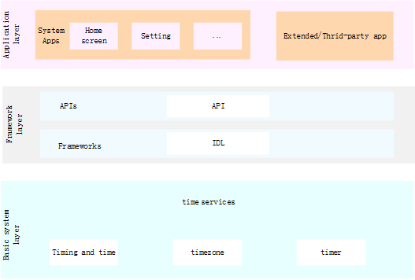

# Timing and Time

## Introduction

The timing and time module provides APIs for managing the system time.

**Figure  1**  Subsystem architecture 



## Directory Structure

```
/base/time/time_service
├── etc                      # Process configuration files
├── figures                  # Architecture diagram
├── framework/js/napi        # the js interface resolves to the napi interface
├── interfaces/inner_api     # external interface code provided by the component
├── services                 # time service realization
│   └── sa_profile           # module contains the config files of system services and processes
├── test                     # unit test of interface
└── utils                    # module contains log printing and constants for ordered commonEvent
```


## Usage

### Available JS APIs

**Table  1**  Major functions of systemTime

| Interface name                                               | describe                                                     |
| ------------------------------------------------------------ | ------------------------------------------------------------ |
| setTime(time : number) : Promise<boolean>                    | Set the system time (1970-01-01 to the present in milliseconds), Promise method. |
| setTime(time : number, callback : AsyncCallback<boolean>) : void | Set the system time (1970-01-01 to the present in milliseconds), callback mode. |
| setDate(date: Date, callback: AsyncCallback<boolean>): void; | Set the system time (Date format), Promise method.           |
| setDate(date: Date): Promise<boolean>                        | Set system time (Date format), callback method.              |
| setTimezone(timezone: string, callback: AsyncCallback<boolean>): void | Set the system time zone, callback method.                   |
| setTimezone(timezone: string): Promise<boolean>              | Set the system time zone, Promise method.                    |

**表 2** Major functions of systemTimer

| Interface name                                               | describe                              |
| ------------------------------------------------------------ | ------------------------------------- |
| createTimer(options: TimerOptions, callback: AsyncCallback<number>): void | Create timer, callback method         |
| createTimer(options: TimerOptions): Promise<number>          | Create timer, promise method          |
| startTimer(timer: number, triggerTime: number, callback: AsyncCallback<boolean>): void | Start the timer, callback mode        |
| startTimer(timer: number, triggerTime: number): Promise<boolean> | Start the timer, promise mode         |
| stopTimer(timer: number, callback: AsyncCallback<boolean>):  void | Stop the timer, callback mode         |
| stopTimer(timer: number): Promise<boolean>                   | Stop the timer, promise mode          |
| destroyTimer(timer: number, callback: AsyncCallback<boolean>): void | Destroy the timer, callback method    |
| destroyTimer(timer: number): Promise<boolean>                | Destroy the timer, the promise method |

**表 3**  parameter TimerOptions description of systemTimer

| name      | type      | illustrate                                                   |
| --------- | --------- | ------------------------------------------------------------ |
| type      | number    | Timer type. <br/>If the value is 1, it is represented as the system startup time timer (the timer start time cannot be later than the currently set system time); <br/>If the value is 2, it is indicated as a wake-up timer; <br/>When the value is 4, it is represented as a precision timer; <br/>If the value is 5, it is represented as an IDLE mode timer (not supported). |
| repeat    | boolean   | true Is a cyclic timer, false is a single timer.             |
| interval  | number    | If it is a cyclic timer, the repeat value should be greater than 5000 milliseconds, and the non-repeated timer is set to 0. |
| wantAgent | wantAgent | Set the wantagent to notify, and notify when the timer expires. |
| callback  | => void   | Set the callback function, which will be triggered after the timer expires. |

### Sample Code

Example fo using systemTime

```javascript
// Import the module.
import systemTime from '@ohos.systemTime';

// Set the system time asynchronously with a Promise.
var time = 1611081385000;   
systemTime.setTime(time).then((value) => {        
    console.log(`success to systemTime.setTime: ${value}`);   
}).catch((err) => {        
    console.error(`failed to systemTime.setTime because ${err.message}`)  
});

// Set the system time asynchronously with a callback.   
var time = 1611081385000;   
systemTime.setTime(time, (err, value) => {   
    if (err) {        
        console.error(`failed to systemTime.setTime because ${err.message}`);   
        return;   
    }    
    console.log(`success to systemTime.setTime: ${value}`);   
});
```
Example fo using systemTimer
```javascript
// Import the module 
import systemTimer from '@ohos.systemTimer';

console.log("start");
var options:TimerOptions{   
   type:TIMER_TYPE_REALTIME,   
   repeat:false,   
   interval:Number.MAX_VALUE/2,   
   persistent:false   
}

console.log("create timer")   
let timerId = systemTimer.Timer(options)     
console.log("start timer")   
let startTimerRes = systemTimer.startTimer(timerId, 100000)   
console.log("stop timer")   
let stopTimerRes = systemTimer.stopTimer(timerId)   
console.log("destroy timer")   
let destroyTimerRes = systemTimer.destroyTimer(timerId)   
console.log('end');   
```

## Repositories Involved

**Time/Timezone subsystem**

[time\_time\_service](https://gitcode.com/openharmony/time_time_service/tree/master/)

